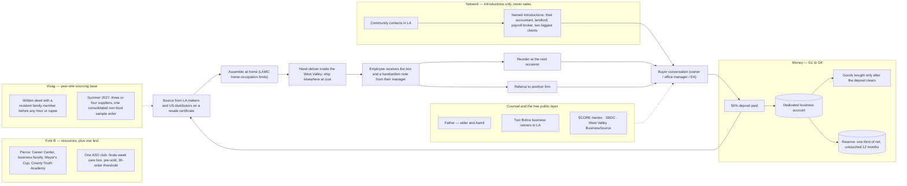

# 12 — THE LAYOUT, v0

> **How this file grows.** This is the operating design. It is written to be
> run, not admired: every part names its rule (`10`), its evidence (`11`) or its
> open question (`13`). Amend by dated entry. The gates in §9 are proposed
> here because `MASTER.md` §21 is not in the repo; when it is, reconcile.

---

## 0. Decision · constraint · smallest test

**The decision.** Start Fork A now: a **prepaid, hand-delivered, occasion
gifting service for 10–200-employee firms within about three miles of Pierce
College**, selling the Q4 2026 season immediately. Fork B (campus) is a
resource fork with one cheap revenue test. Vizag is a sourcing and design base
in year one, not a selling market. Nothing national, nothing manufactured,
nothing on credit.

**The governing constraints, in order.**

| # | Constraint | Why it governs | Where it is decided |
|---|---|---|---|
| 1 | **US work status** | If F-1, operating is unauthorised work; the design changes | `13` Q1 |
| 2 | **The Q4 clock** | Custom work closes mid-October; deliveries end by 11 December | `11 §2` |
| 3 | **Hours** | 10–15 a week in semester caps volume at roughly 250 boxes a season | `13` Q5 |
| 4 | **Cash** | $500 float, zero credit, prepay only | G1–G3 in `10` |
| 5 | **R5** | No months inside the industry; route must be chosen | `13` Q2 |

**The smallest next test.** Twenty buyer conversations and three paid deposits
by **Friday 16 October 2026** (Gate 1, §9). Cost: samples inside the float and
about sixty hours. If the network cannot produce twenty conversations, that is
the finding.

## 1. The system in one picture

**The three-mile radius.** The masjid (5701 Platt Ave), Pierce College (6201
Winnetka Ave), the Warner Center office towers, the West Valley BusinessSource
Center in Reseda and the 0% capital arm in Calabasas all sit within a few miles
of each other (`11 §12`). Year one never needs to leave that circle. That is
the single largest structural advantage in the whole design, and it was not in
the brief.

## 2. The offer, v0

**Positioning, one line:** *Occasion gifting for small teams in the West
Valley — curated, hand-delivered, prepaid, from ten boxes.*

| Tier | Price per recipient (assumed) | What it is | Who buys it |
|---|---|---|---|
| **Appreciation** | ~$35 | Two or three quality items, one dietary-safe variant, card | 10–30-person firms; Employee Appreciation Day; onboarding |
| **Occasion** | ~$60 | Four or five items, choice of two variants, handwritten note card | The Q4 holiday box; Diwali, Lunar New Year, Eid variants |
| **Milestone** | ~$95 | Premium curation, one personalised item, presentation box | Work anniversaries, executive and client gifts |

Prices sit on the observed $62–65 average per employee (`11 §3`) and are
**unvalidated until ten buyer conversations confirm them.** They include
assembly and hand delivery inside the West Valley; shipping elsewhere is
charged separately at cost (which keeps it out of sales tax, Reg. 1628).

**The calendar bundle.** Holiday box + Employee Appreciation Day box + one
custom occasion, sold during the Q4 sale, **fully prepaid**, about 10% off.
Converts a Q4 buyer into Q1 revenue without a second sales cycle. This is the
"service" in the brief: the buyer hands over the calendar.

**Year-one occasion calendar and sell-by dates.**

| Occasion | Date | Orders close | Deliver by |
|---|---|---|---|
| Boss's Day | Fri 16 Oct 2026 | 9 Oct | 15 Oct |
| Diwali | Sun 8 Nov 2026 | 16 Oct | 6 Nov |
| Holiday | Thanksgiving → 18 Dec | **13 Nov** | 11 Dec (before the carrier damage window) |
| Lunar New Year | Sat 6 Feb 2027 | 15 Jan | 4 Feb |
| Employee Appreciation Day | Fri 5 Mar 2027 | 5 Feb | 4 Mar |
| Eid al-Fitr | ≈ 9–10 Mar 2027 | 12 Feb | 8 Mar |
| Administrative Professionals Day | 21 Apr 2027 (verify) | 26 Mar | 20 Apr |
| Work anniversaries, onboarding, new baby, get well | on demand | 10 days' notice | — |
| Ashara Mubaraka closure | ≈ first week of June 2027 (verify) | **no deliveries promised across it** | — |

**Terms (G1, non-negotiable in year one).** Ten-box minimum · 50% deposit at
signing · balance ten days before delivery · goods bought only after the
deposit clears · changes accepted up to fourteen days before delivery · no
net-30. A buyer who insists on terms gets a deposit covering cost of goods, or
a polite no.

**Not offered.** Alcohol · gift cards · custom-branded merchandise under 25
units in Q4 2026 (rush and setup fees eat the margin) · gifts to healthcare
referral sources · public agencies as buyers (`11 §7`) · anything made in a
home kitchen.

**In every box.** The manager's handwritten note (62% say it makes the gift
meaningful, `11 §5`) · allergen insert on any food item · original vendor
labels intact · a small, discreet card naming the service — the recipient is
next season's buyer (`10 §3`, barakat).

## 3. Buyers and channels (Fork A)

**Ideal customer, year one.** 10–200 employees · decision made by the owner,
office manager or executive assistant · located in Woodland Hills, Warner
Center, Calabasas, Tarzana, Encino, Canoga Park or Chatsworth · pays by card
or bank transfer upfront. Segments that fit: accounting, law and insurance
offices; real-estate brokerages; medical and dental practices gifting **their
own staff**; small agencies and tech firms; coworking community managers
gifting members.

**Channels, ranked. No advertising.**

| # | Channel | Mechanic | Weekly target | Evidence |
|---|---|---|---|---|
| 1 | **Named introductions** | Each community contact asked for four named people (accountant, property manager, payroll or benefits broker, two biggest B2B clients) via a forwardable double opt-in email | 5–8 asks | `11 §6`, `§12` |
| 2 | **Pilots** | Two or three introduced firms get a discounted first order in exchange for photos and a two-line testimonial | 3 total | founder pattern, `11 §6` |
| 3 | **Local rooms** | West Valley–Warner Center Chamber mixer (4th Wednesday); PIHRA as a student member ($35/yr); one BNI chapter as a free guest; a $39 WeWork day pass to meet the community manager | 1 event | `11 §6` |
| 4 | **LinkedIn, trigger-based** | 25 personalised requests a week to office managers and HR at 10–200-person West Valley firms, referencing a trigger (new lease, hiring, Employee Appreciation Day); expect ~10 accepts and 2–3 conversations | 25 | `11 §6` |
| 5 | **Proof surfaces** | Google Business Profile with the first five reviews; LinkedIn photo posts of real boxes; a one-page Carrd site with the order form | ongoing | `11 §6` |

**Weekly rhythm at twelve hours.** 4 h introductions and outreach · 3 h
conversations and proposals · 3 h sourcing, samples and assembly · 2 h
admin, counsel and the log.

**What is said to the network.** *"I'm building a small gifting service for
companies. I'm not asking you to buy. I'm asking for an introduction to
[named person], because they run a team and I'd like fifteen minutes with
them."* The ask states the boundary. Whether Bohra-owned firms may themselves
buy is `13` Q3.

## 4. Fork B — the campus

**Take now (resources).** Career Center appointment · a Business
Administration instructor as an adviser and the Small Business Entrepreneur
certificate · LACCD LinkedIn Learning · the LA Mayor's Cup (Pierce
qualifies) · LA County Youth Entrepreneurship Academy (community-college
cohort) · Foundation for Pierce College scholarship search (Albrecht prefers
entrepreneurship interest) · SCORE/SBDC as a student.

**One revenue test.** Partner with one ASO-chartered club you do not lead on
a finals-week care box: the club pre-sells at Club Rush and by list with
payment upfront; you fulfil. Pre-sale mid-November; delivery finals week
(14–20 Dec 2026). **Threshold: 30 paid pre-orders in two weeks.** Miss it and
the student-consumer question closes — the campus stays a resource. Ask the
ASO adviser first; conflict-of-interest rules apply to officers.

**After transfer.** Anderson Venture Accelerator (UCLA), Blackstone LaunchPad
and the New Venture Seed Competition (USC), or the Bull Ring (CSUN) — and, at
a residential campus, parent-funded milestone gifting becomes a real sliver.
Not before.

## 5. Vizag — year-one role

**Role:** sourcing, design and prototyping base. **Not** a selling market
until Diwali 2027 at the earliest, and only under a written deed with a named
resident operator (R4, `02`).

| When | What | Rule |
|---|---|---|
| Winter break (21 Dec 2026–3 Jan 2027), if travelling | Counsel with your father (R6) · draft the family deed if a Vizag operator is even possible · walk three supplier candidates · **optional** Sankranti/New Year micro-pilot of 25–50 units for one or two private employers, only if deed and status allow | G5, G6, `13` Q1 and Q4 |
| Summer 2027 (mid-June–August) | Three or four supplier relationships via BohraConnect, DBohra and EPCH members · IEC, LUT and Udyam under the deed-holder · **one** consolidated non-food sample order shipped to LA · Raksha Bandhan / Independence Day pilot if the January one worked | `11 §10–11` |
| Q4 2027 | Diwali (29 Oct 2027) as the first Vizag selling season worth planning — orders placed Aug–Oct, so the summer visit is the sales trip | `11 §10` |

**For counsel before any rupee moves:** FEMA non-repatriation proprietorship
rules for an NRI · whether a resident family member should own the entity ·
GST (₹40 lakh goods / ₹20 lakh services; inter-state supply forces
registration) · FBAR / Form 8938 / Form 8858 if you are a US tax person · DTAA
· whether directing an Indian business from the US on F-1 is itself
employment (`11 §8`).

## 6. Money

**Rules.** G1 prepay · G2 no inventory · G3 $500 float, logged · G4 one third
of net to reserve (`10 §4`).

**Flow.** Deposit invoice (Wave or Stripe) → dedicated business bank account
→ goods purchased on the resale certificate → balance invoice ten days out →
delivery → one third of net to the reserve account → float replenished to
$500 from the rest.

**Start-up cash inside the float.**

| Item | Cost | Note |
|---|---|---|
| EIN | $0 | Use it on every W-9 instead of an SSN |
| LA County DBA + newspaper publication | ~$26 + $45–100 | Only after `13` Q1 |
| CDTFA seller's permit | $0 | Resale certificates for inventory |
| City of LA BTRC | $0 | Exemption ≤ $100K receipts if renewed by end of February |
| Carrd site | $0–19/yr | Order form and lookbook link |
| Three sample kits and materials | ~$250 | The only stock that ever exists |
| **Total** | **~$370** | $130 headroom in the float |

General liability insurance (~$250–1,750/yr) is bought from the **first
revenue**, before the first food box and before any client asks for a
certificate. Not from the float.

**Q4 2026 base case — conservative, assumptions stated.**

| | Kill | Base | Good |
|---|---|---|---|
| Paying companies | 3 | 6 | 12 |
| Recipients per company | 15 | 15 | 20 |
| Boxes | 45 | 90 | 240 |
| Average price | $60 | $60 | $60 |
| Revenue | $2,700 | $5,400 | $14,400 |
| Cost of goods, packaging, delivery (58%) | $1,566 | $3,132 | $8,352 |
| Gross profit (42%) | $1,134 | $2,268 | $6,048 |
| Fixed costs (registrations, insurance, tools, samples) | ~$680 | ~$680 | ~$680 |
| **Net** | **~$450** | **~$1,590** | **~$5,370** |
| Hours (setup, selling, assembly, delivery, admin) | ~120 | ~165 | ~260 |
| Net per hour | ~$4 | ~$10 | ~$21 |
| To reserve (one third of net) | ~$150 | ~$530 | ~$1,790 |

Assumptions: product 42% of price, packaging 8%, delivery 8% (`11 §3` markups
imply product near half of price; local hand delivery pulls it down); twenty
minutes of assembly per box; roughly three hours of selling per closed account
including losses; forty hours of one-time setup.

**Read it plainly.** Q4 2026 is a proof quarter, not an income quarter. At
base it pays near minimum wage. What it buys is photos, five reviews, three
to six accounts with a 75%-repeat norm behind them (`11 §3`), and validated
prices — the inputs Employee Appreciation Day and the calendar bundle need.

## 7. Legal stack — branches on status

| Status | Design | First steps |
|---|---|---|
| **Citizen or permanent resident** | You own and operate. Sole proprietor with DBA; LLC later | EIN → DBA → seller's permit → BTRC → insurance from revenue → LLC when a client requires it or trailing revenue passes ~$25K |
| **F-1** | You may own and prepare (plan, entity, research, relationships); you may not buy, pack, sell or deliver, even unpaid, without CPT/OPT (`11 §8`). Two lawful shapes: (i) a work-authorised operator under a written deed — Mudaarabat with you as the design and relationship side, them as the operating side (`02`); (ii) wait for post-completion OPT, where a self-employed owner is recognised if the business relates to the degree | Confirm with the Pierce international student office and an immigration attorney **before any operating act**. Research, design and counsel conversations continue meanwhile |

**Sales tax discipline from box one.** Itemised cost and retail sheet per
SKU; tax charged on the non-food portion under the Reg. 1602 method; own-vehicle
delivery is taxable, carrier charges stated separately at cost are not.

**Counsel checklist (from `11 §8`).** Immigration (if F-1) · CPA on DBA vs LLC
and district-tax sourcing · CDTFA written advice on box taxability · LA County
DPH on home assembly of sealed food · insurance broker on GL, product and
hired/non-owned auto · cross-border CPA and an Indian CA before Vizag.

## 8. Calendar — September 2026 to June 2027

| Window | Fork A | Fork B | Vizag | Rule / gate |
|---|---|---|---|---|
| **2–15 Sep** | Answer `13` Tier 1 · four counsel conversations · three sample kits, lookbook, price sheet · list 40 contacts and their four named people · SCORE request, BusinessSource intake | Career Center appointment; ask a Business instructor to advise | — | G3, G6 |
| **16–30 Sep** | First 15 introduction asks · ten conversations · chamber mixer 23 Sep · three pilots offered | Identify one club and its adviser | — | Rung 1: validate before building |
| **1–16 Oct** | Ten more conversations · eight mini samples hand-delivered · proposals with the calendar bundle · PIHRA student membership · Boss's Day and Diwali orders close | Mayor's Cup calendar checked | — | **Gate 1, Fri 16 Oct** |
| **17–31 Oct** | Close holiday orders and collect deposits · Diwali boxes delivered by 6 Nov · chamber mixer 28 Oct | — | — | G1 |
| **1–13 Nov** | **Holiday orders close 13 Nov** · goods ordered with deposit cash only · publish pilot photos and first reviews | Club pre-sale opens (two-week window) | — | G2 |
| **14 Nov–11 Dec** | Assemble and deliver in two waves · all shipping done by 11 Dec · balance invoices | Care boxes delivered finals week (14–20 Dec) | — | Carrier damage window avoided |
| **12–20 Dec** | Review and testimonial asks · one-page case study · calendar-bundle upsell to every buyer and open lead, deposit by 15 Jan | Club test scored against the 30-order threshold | — | R2: first reserve transfer |
| **21 Dec–3 Jan** | Quiet | — | If travelling: counsel with father · deed drafted if an operator exists · three suppliers walked · optional Sankranti micro-pilot | G5 |
| **Jan–Feb 2027** | Lunar New Year boxes (close 15 Jan) · second introduction round · Employee Appreciation Day closes 5 Feb | Winter session; County Youth Academy if a cohort opens | Payment rail and IEC questions to a CA | — |
| **5 Mar 2027** | Employee Appreciation Day deliveries — **repeat rate measured here** | — | — | Second proof point |
| **Apr 2027** | Administrative Professionals Day (21 Apr, verify) · LLC decision on the numbers · Mayor's Cup entry if a pilot exists | — | — | — |
| **May 2027** | Small parent-funded commencement gift test (Pierce commencement is early June) · Q4 2027 planning | — | Summer trip planned as a sales-and-sourcing trip | — |
| **June 2027** | **Gate 2** · Ashara closure marked (≈ first week of June; verify) | Transfer applications inform Fork B v1 | Summer sourcing trip begins | **Gate 2** |

## 9. Gates and kill criteria — proposed

**Gate 1 — Friday 16 October 2026.**
- **Pass:** at least 20 buyer conversations held **and** at least 3 deposits
  paid.
- **Fail:** fewer than 3 deposits → no further sample spend; fulfil only what
  is deposited; re-examine the offer with counsel before Employee
  Appreciation Day. If fewer than 10 conversations could even be booked, the
  network-first hypothesis failed — stop and rethink the entry, not the box.

**Gate 2 — June 2027.**
- **Pass (all four):** at least 8 paying companies cumulative · at least 40% of
  Q4 accounts reordered for any occasion · gross margin at or above 35% ·
  net per hour at or above $15 over the trailing two quarters.
- **Fail on any two** → kill, or pivot to occasion work (weddings and events,
  where several of the founders in `11 §6` started) — decided with counsel and
  logged in the `01` Incident Log.

**Standing stop rules.** Personal cash beyond the $500 cap → stop until
revenue replaces it (G3). Any order that needs credit → decline (G1). Any G7
line crossed → that segment closes.

## 10. Ranked actions — the only five for the next fourteen days

1. **Answer `13` Tier 1** — Q1 (status) and Q2 (R5 route) first. Every legal
   step and the launch date branch on them.
2. **Counsel round (G6):** your father; two Bohra business owners in LA who
   buy staff gifts; a SCORE Ventura mentor request. Log each in the `05`
   access log.
3. **Build the offer artifacts inside the float:** three sample kits, a
   one-page lookbook, a price sheet with the prepay terms, and the
   forwardable introduction email.
4. **List 40 community contacts** and, for each, the four named people you
   want to meet. Send the first fifteen asks.
5. **Book the free rooms:** West Valley BusinessSource intake, the chamber
   mixer on 23 September, PIHRA student membership. Registrations (EIN, DBA,
   seller's permit, BTRC) follow the Q1 answer, not precede it.

## 11. The horizon — a ladder, not a plan

| Rung | When | Shape |
|---|---|---|
| **Trade** | Year 1, to June 2027 | West Valley, hand-delivered, prepaid, calendar bundles |
| **Growth** | Year 2 | LA County by referral chain; shipped boxes at cost; the calendar plan as the core product; LLC; first Vizag-sourced non-food items; Diwali 2027 Vizag pilot under the deed |
| **Expansion** | Year 3+ | Remote-team gifting for companies across America, reached through the referral chains of year-one recipients; supplier relationships in Vizag deep enough to specify products |
| **Industry** | When Gate 2 has passed twice | Own-label items made in Vizag — the doctrinally preferred rung (`00 §3`); 0% capital from `05` if inventory ever needs financing |

---

## Amendments
*(append-only. Date | Section | Change | Reason)*

| Date | Section | Change | Reason |
|---|---|---|---|
| — | — | *v0 as written* | — |
